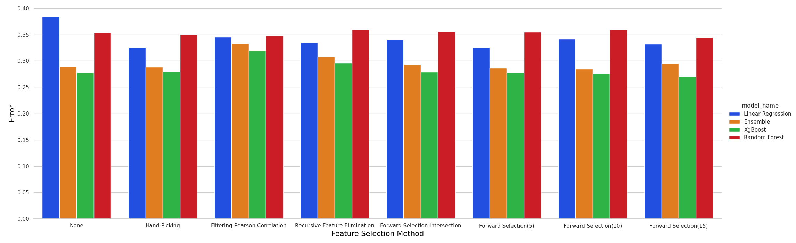
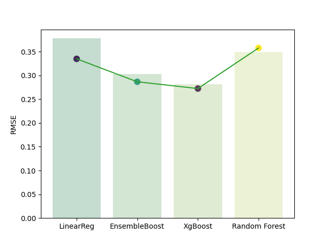

# Effect of 311 service complaints on Airbnb Prices 

The aim of this project is to predict Airbnb prices in NYC. We try to analyse the effect of 311 service complaints in a given zipcode on the Airbnb prices. 

## Getting Started

These instructions will get you a copy of the project up and running.

## Running the Project

Run the following commands inside the Price-prediction directory 
```
pip3 install -r requirements.txt
python3 app.py
```
The above will take about 30-40 mins to execute completely. 

Alternatively, login to NYU High Performance Cluster Prince, make sure conda is installed and then run the sbatch script.

```
sbatch runscript.s
```
The project structure is described below.

## Data Cleaning 

* Navigate to the data-cleaning directory to find the scripts that were used for preprocessing the respective datasets. 
* Under 311-dataset-cleaning, the scripts clean.py and count_per_complaint_type.py directly perform actions on the original dataset which can be found on https://data.cityofnewyork.us/Social-Services/311-Service-Requests-from-2010-to-Present/erm2-nwe9 , it hasn't been added to this repository due to it's size ( greater than 7GB)
* The get_one_hot.py script, takes the count_by_incident_zip_complaint_type_2010.csv which contains relevant columns from the 311 dataset that were used for the project. 
* The pre-processed datasets for both Airbnb and 311 service complaints dataset (Airbnb_processed2.csv and complaint_type2.csv) can be found in the dataset directory.

## Data Visualisation

* Navigate to the visualisations directory to find the different visualisations on the processed datasets along with the scripts for the same. 
* Tableau was also used to perform few visualisations on the Airbnb dataset.

## Data Integration

* Navigate to the data-integration directory to find the script used for integration. 
* The two datasets, Airbnb and 311 service complaints are merged using zipcode. 
* This dataset can be found in the dataset directory labelled as Airbnb_Service_complaints_merged.csv

## Feature Selection

* Navigate to the feature-selection/ directory, several methods of feature-selection were used. 
* The different methods are as follows:
    - Recursive feature elimination
    - Handpicking
    - Correlation
    - Forward- selection
* The results for these can be found in the results directory containing csv files after performing the various feature selection techniques.

## Data Modeling 

* Several data modeling techniques such as:
    - Linear Regresssion
    - Ensemble Boost
    - XgBoost
    - Random Forest
    - K-Nearest Neighbors
* Results for the K-Nearest Neighbors have not been included due to the large amount of time taken to run it, however the script that was used is present in the models directory.  
* The run_models.py script uses all the modeling techniques on all the feature selection methods that were tried in the previous section. 
* The resultant csv which contains RMSE values for each model for each of the feature selection techniques could be found in the results directory as the "errors.csv".
* We ran the scripts for each of the models individually to generate a csv per model which gave the RMSE per complaint type, these results were used in the forward selection technique under feature-selection. 
* These scripts are present in the models directory for reference, however these need not be run as a part of the project. 

## Results Analysis

* This section contains key findings from our project. 



* The above graph shows the root mean squared error values for the various feature selection techniques for all the models that were implemented in the feature-selection section of the project. 
* We found forward selection to be the best feature selection technique for this project. 
* Boosting in general gave the least root mean squared error values. 



* The above graph shows the root mean squared error values for the baseline Airbnb model vs the root mean squared values (represented by the line plot) for our best feature selection technique. 
* We find that boosting performs the best amongst all the models tried. 

## Beeline Instructions
1. Download the file:
$ wget https://data.cityofnewyork.us/api/views/dbhh-68ph/rows.csv?accessType=DOWNLOAD

2. Strip the headers from data:
$ tail -n +2 311_data.csv > 311_data_no_headers.csv

3. Make a directory in HDFS for your data:
$ hdfs dfs -mkdir Data

4. Put .csv file into HDFS:
$ hdfs dfs -put 311_data_no_headers.csv Data

5. Connect to beeline as described https://wikis.nyu.edu/display/NYUHPC/Clusters+-+Dumbo 

6. Run the sql queries in the beeline folder in the follwing order:
    - createSchema.sql
    - count_per_zip.sql   
    - avg_complaint_coords.sql                                    
    - least_common_complaint.sql      
    - top_complaints.sql
   


